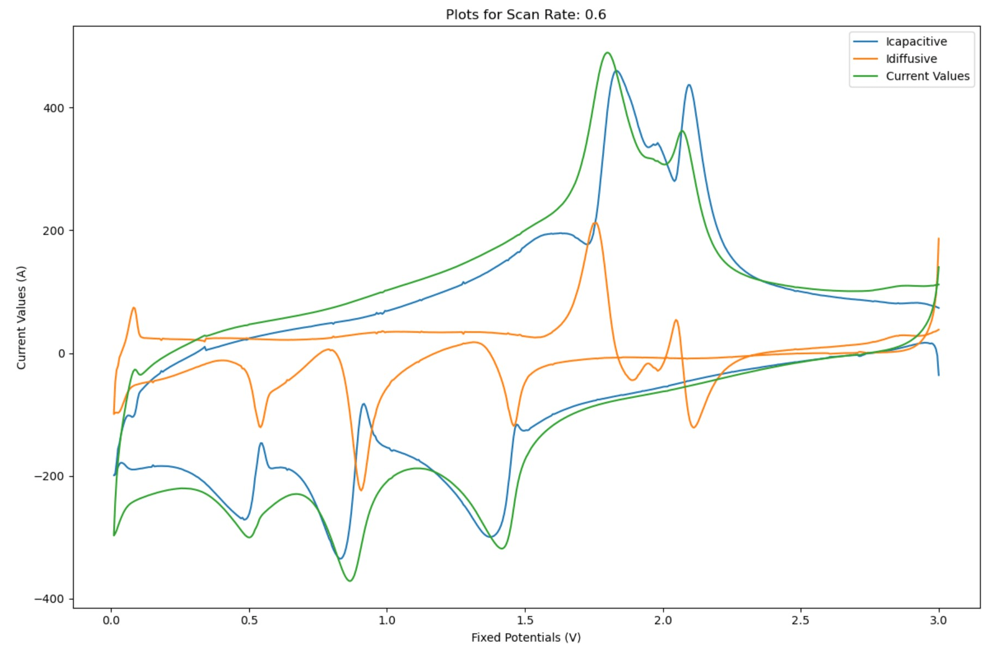

# Introduction
In today’s world, there is an ever-increasing demand for electrochemical energy storage like batteries and supercapacitors due to **sustainable energy** and **technological advancements**. Researchers have been looking for **state-of-the-art materials** and designs to deal with this need. While these efforts have significantly enhanced energy storage systems, the **underlying mechanisms** driving their effectiveness are not yet fully understood. One of the essential techniques is **Cyclic Voltammetry (CV).**

# Cyclic Voltammetry
CV is a **multifaceted** and **powerful tool** in the realms of material science and electrochemistry, holistically providing insights into the **redox behavior** of materials. This test can be applied to a wide range of materials in diverse applications involving the **electron-transfer process**. 

In CV, the working electrode's **potential is varied** stepwise between two predetermined values, and the response **current is recorded**. During the negative potential scanning, all species at the electrode interface undergo **reduction**, resulting in the recording of a **cathodic current**. Conversely, when the potential is positively swept, the **oxidation** of these species produces an **anodic current**. The reiteration of these cycles will be continued until reaching a **cyclical steady state**. 

# Handling Complex Systems
Since most systems are **inherently complex** and often include **multiple redox reactions simultaneously**, resulting in **overlapped peaks**, we need to accurately separate these from each other to examine the **electron transfer-initiated chemical reactions** in more detail.

# Dunn Method for Capacitive and Diffusive Contributions
The **Dunn method** is a widely used approach to differentiate and analyze the **capacitive and diffusive contributions** to the total current in electrode materials. This method is particularly used for studying **energy storage devices** like supercapacitors and batteries.

Capacitive current: i(v) ∝ v → i(v) = k₁v

Diffusion-controlled current:i(v) ∝ √v → i(v) = k₂√v

Total current: i(v) = k₁v + k₂√v

i(v)/√v = k₁√v + k₂

# How to use this repository
This repository includes a **Python-based script** designed to perform **deconvolution and visualization** of cyclic voltammetry (CV) data using the **Dunn method**. The script facilitates the separation of **capacitive** and **diffusive contributions** to the total current. After executing the code, it will generate an Excel file with the calculated k₁ and k₂ values.
1. Perform CV experiments at least two scan rates (ensure the recorded potential interval remains consistent across all scan rates, resulting in fixed potentials).
2. Format the data Excel as follows:
   - **First Column:** Keep the potentials (fixed potentials) in this column.
   - **Subsequent Columns:** Organize the corresponding currents for each scan rate in the following columns.
  
   

3. Open the file src/CapDiffAnalyzer.ipynb in Jupyter Notebook, and load your formatted Excel data using the following code line (line 12): "data = pd.read_excel('example.xlsx')"

4. Run the code!

# Example results derived from real laboratory data for an anode of a sodium-ion battery.

          **Evaluated k₁ and k₂ coefficients**

   

          **CV curves with capacitive and diffusive contributions at the scan rate of 0,2 mV/s**

          **CV curves with capacitive and diffusive contributions at the scan rate of 0,6 mV/s**

          **CV curves with capacitive and diffusive contributions at the scan rate of 0,8 mV/s**

